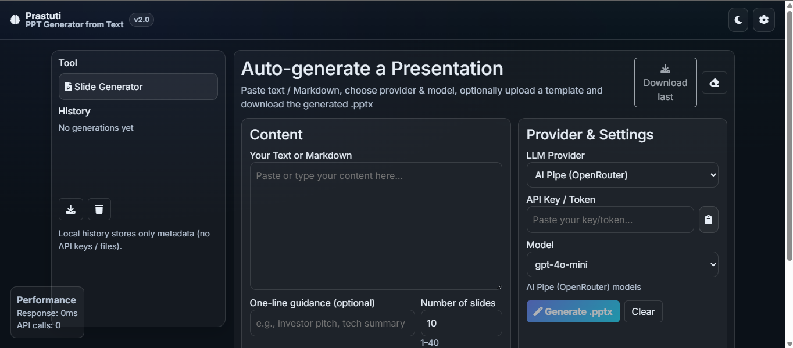
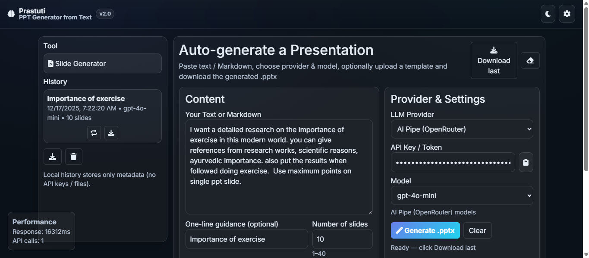
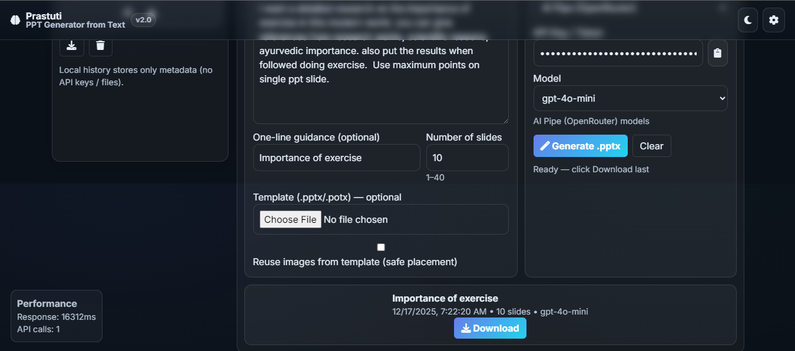

# 🚀 **Prastuti — PPT Generator from Text**

### *Your Text. Your Style. Instant PPT.*

**Prastuti** is a powerful, minimal, and fast **AI-powered PPTX generator**.
Paste any text or markdown → choose your LLM (OpenAI / Claude / Gemini / AI Pipe) → optionally upload your PPTX template → download a **beautiful, structured presentation** instantly.

---

## ⭐ **Why Prastuti?**

* 📝 Convert long text / notes / markdown → **structured slides**
* 🎯 Give **one-line guidance** (e.g., *make it a pitch deck, research summary, interview brief*)
* 🤖 Works with **OpenAI, Gemini, Anthropic, AI Pipe**
* 🎨 Bring your **own PPTX / POTX template**
* 🖼️ **Reuse images** from template with **safe placement (no overlap)**
* ⚡ **Enforces slide count** (1–40) — smart splitting & merging
* 🔒 **Zero data saved** — No logs, no text storage, no API key storage
* 💻 Fully client-side UI + FastAPI backend

---

# 🧩 **Project Structure**

```
Prastuti/
│
├── app.py                # FastAPI backend for slide planning + PPTX generation  
├── index.html            # Complete UI (dark/light theme, history, models, etc.) 
├── requirements.txt      # Backend dependencies                                 
├── vercel.json           # Deployment config for Vercel                         
├── README.md             # (Replaced by this new README)                        
└── favicon.ico           # App icon
```

---

# 🧩 **How Prastuti Works (High-Level Flow)**

### **1) User Inputs**

* Text / Markdown
* Optional one-line guidance (e.g., *“summarize like a pitch deck”*)
* Slide count target
* Provider + model
* Template file (optional)

### **2) Slide Planning via LLM**

Your backend generates a strict JSON-only prompt instructing the LLM to produce:

```json
{
  "slides": [
    { "title": "Heading", "bullets": ["Point 1", "Point 2"] }
  ]
}
```

Prompt & constraints implemented in `app.py`. 

### **3) Slide Count Enforcement**

* Too few slides? → Auto-split into continuation slides
* Too many slides? → Auto-merge into concise slides
* Always respects target range 1–40

### **4) PPTX Construction**

Prastuti uses a custom PPTX engine (your `build_presentation_from_plan()` function):

* Loads template (if given)
* Extracts template images
* Places them **before text** so text stays readable
* Detects collisions between images and text zones
* Repositions images to *safe zones*
* Inserts titles + bullets cleanly

All handled inside backend logic.


### **5) Instant Download**

The user receives a ready-to-present `.pptx` file.

---

# 🛠️ **Tech Stack**

### **Frontend**

* Pure **HTML + CSS + JavaScript**
* Bootstrap utilities
* Dark/light theme toggle
* Model-selector UI
* Local History (no API keys stored)
* Real-time feedback + performance metrics
  (Captured from `index.html` UI)  

### **Backend**

* **FastAPI**
* **python-pptx** for PPTX creation
* Supports:

  * `OpenAI`
  * `AI Pipe (OpenRouter)`
  * `Anthropic`
  * `Google Gemini`

Backend logic (from `app.py` includes):
✔ Retry mechanism
✔ Slide planning
✔ Enforcing slide count
✔ Template parsing
✔ Image extraction + safe placement
✔ PPTX generation  

### **Routing Config**

* `vercel.json` maps everything to FastAPI


---

# 🧪 **Usage Guide**

### **Step 1:** Paste text / markdown

### **Step 2:** Enter optional one-line guidance

### **Step 3:** Choose provider and model

### **Step 4:** Enter API key

### **Step 5:** (Optional) Upload template `.pptx / .potx`

### **Step 6:** Click **Generate PPTX**

The UI automatically:

* Tracks history
* Stores no sensitive info
* Supports re-generation
* Offers direct download

---

## 🖼️ UI Screenshots

### Main Dashboard


### Filled Content & Settings (DEMO)



---


## 📄 Output — Generated PPT

To demonstrate Prastuti’s end-to-end functionality, a sample presentation generated by the system is included below.
The input is attached in the "Filled Contents & Settings (DEMO)"

**NOTE :- For Demo, I have not given any Template while input. The Demo output below has by default "Plain White" Template.**

### 🔹 Sample Output File
- 📎 [`sample_output_prastuti.pptx`](output/sample_output_prastuti.pptx)


---


# 📁 **Backend API**

### `POST /generate`

**Form Fields:**

| Name         | Type              | Description                          |
| ------------ | ----------------- | ------------------------------------ |
| text         | string            | Raw/markdown text                    |
| guidance     | string (optional) | Tone/directive                       |
| provider     | string            | openai / aipipe / gemini / anthropic |
| api_key      | string            | User’s API key                       |
| model        | string            | Model ID                             |
| num_slides   | int (1–40)        | Desired slide count                  |
| template     | file              | PPTX/POTX file                       |
| reuse_images | bool              | Copy images from template            |

**Response:** PPTX file stream

---

# 🧠 **LLM Behavior**

The backend enforces:

* Title ≤ 80 chars
* 3–6 bullets per slide
* Bullets ≤ 120 chars
* JSON-only output

Prompts, slide planning, splitting, merging, and fallback logic are all implemented inside `app.py`.


---

# 🔒 **Privacy Policy (Developer-friendly)**

* No input text stored
* No API key stored
* No template stored
* History stored **only locally in browser**
* Zero logging of personal data

This makes Prastuti suitable for:
✔ Educational content
✔ Corporate documents
✔ Confidential research
✔ Internal presentations


---

# 📌 **Roadmap (Future Enhancements)**

* Live slide preview
* Speaker notes generation
* Predefined templates (pitch deck, research summary, training module)
* Multi-slide layout detection
* Cloud storage support

---
## 🙌 **Acknowledgements**

Prastuti is powered by your custom-engineered:

* FastAPI backend
* PPTX builder
* LLM router
* Template extractor
* Smart image engine
* Clean UI

Every part of this system reflects thoughtful engineering and a product-focused mindset.
---
